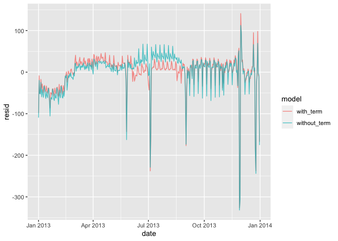
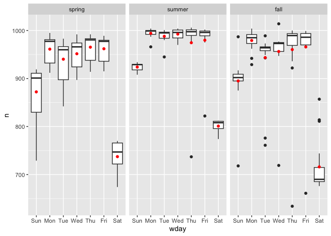
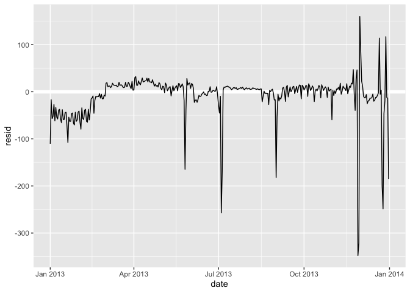
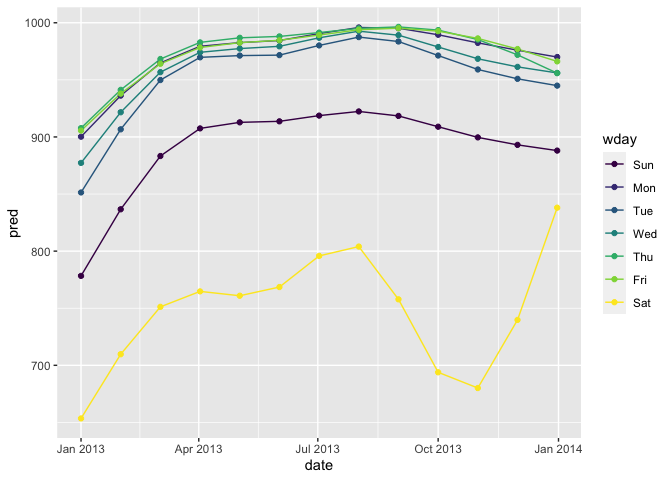

Chapter 24: Model building
================
Dat
2023-03-30

# 24 Model building

## 24.1 Introduction

Load library cần thiết

``` r
library(tidyverse)
```

    ## ── Attaching core tidyverse packages ──────────────────────── tidyverse 2.0.0 ──
    ## ✔ dplyr     1.1.1     ✔ readr     2.1.4
    ## ✔ forcats   1.0.0     ✔ stringr   1.5.0
    ## ✔ ggplot2   3.4.2     ✔ tibble    3.2.1
    ## ✔ lubridate 1.9.2     ✔ tidyr     1.3.0
    ## ✔ purrr     1.0.1     
    ## ── Conflicts ────────────────────────────────────────── tidyverse_conflicts() ──
    ## ✖ dplyr::filter() masks stats::filter()
    ## ✖ dplyr::lag()    masks stats::lag()
    ## ℹ Use the conflicted package (<http://conflicted.r-lib.org/>) to force all conflicts to become errors

``` r
library(modelr)
options(na.action = na.warn)

library(nycflights13)
library(lubridate)
```

Vì sao kim cương chất lượng thấp lại đắt hơn

``` r
ggplot(diamonds, aes(cut, price)) + geom_boxplot()
```

<!-- -->

``` r
ggplot(diamonds, aes(color, price)) + geom_boxplot()
```

<!-- -->

``` r
ggplot(diamonds, aes(clarity, price)) + geom_boxplot()
```

<!-- -->

Note: màu chất lượng thấp nhất là J (hơi ám vàng), vàng mức trong suốt
tệ nhất là I1 (nhìn thấy được bằng mắt thường)

### 24.2.1 Carat và giá

Nếu nhìn theo biểu đồ, kim cương giá cao liên hệ nhiều với lại chất
lượng kém, nhưng thật tế có một confounder ảnh hưởng đến mối quan hệ này
là cân nặng (carat). Độ nặng kim cương thường là chuẩn định giá của kim
cương và kim cương càng to thì càng nhiều khả năng kém chất lượng

``` r
ggplot(diamonds, aes(carat, price)) +
  geom_hex(bins = 50)
```

<!-- -->

Đầu tiên để data dễ nhìn hơn. Chúng ta cần làm

1.  Tập trung vào những kim cương nhỏ hơn 2.5 carat (99.7%)
2.  Biến đổi log carat và giá thành

``` r
diamonds2 <- diamonds %>% 
  filter(carat <= 2.5) %>% 
  mutate(lprice = log2(price), lcarat = log2(carat))
```

Mối liên hệ giữa carat và price sẽ rõ hơn

``` r
ggplot(diamonds2, aes(lcarat, lprice)) + 
  geom_hex(bins = 50)
```

<!-- -->

Mối quan hệ tuyến tính -\> fitting một model tuyến tính vào

``` r
mod_diamond <- lm(lprice ~ lcarat, data = diamonds2)
```

Sử dụng model để tạo ra giá trị dự đoán (prediction) và gắn vào chung
trong graph

``` r
grid <- diamonds2 %>% 
  data_grid(carat = seq_range(carat, 20)) %>% 
  mutate(lcarat = log2(carat)) %>% 
  add_predictions(mod_diamond, "lprice") %>% 
  mutate(price = 2 ^ lprice)

ggplot(diamonds2, aes(carat, price)) + 
  geom_hex(bins = 50) + 
  geom_line(data = grid, colour = "red", size = 1)
```

<!-- -->

``` r
#> Warning: Using `size` aesthetic for lines was deprecated in ggplot2 3.4.0.
#> ℹ Please use `linewidth` instead.
```

Kiểm tra giá trị các residual

``` r
diamonds2 <- diamonds2 %>% 
  add_residuals(mod_diamond, "lresid")

ggplot(diamonds2, aes(lcarat, lresid)) + 
  geom_hex(bins = 50)
```

<!-- -->

Residual không còn ở dạng linear

Ngoài ra còn có thể lặp lại motivating plots dùng giá trị residual thay
cho giá

``` r
ggplot(diamonds2, aes(cut, lresid)) + geom_boxplot()
```

<!-- -->

``` r
ggplot(diamonds2, aes(color, lresid)) + geom_boxplot()
```

<!-- -->

``` r
ggplot(diamonds2, aes(clarity, lresid)) + geom_boxplot()
```

<!-- -->

Biểu đồ sử dụng residual của model price theo carat sẽ đúng như dự đoán,
chất lượng của kim cương lại ảnh hưởng đến giá đúng chiều.

Cách đọc trục tung:

- Residual = -1 có nghĩa là lprice giảm 1 unit nhỏ hơn prediction chỉ sử
  dụng carat.
- 2^(-1) = 1/2, các điểm có giá trị -1 là giá thực tế bằng 1/2 của giá
  prediction

### 24.2.2 Các dạng model phức tạp hơn

Thêm color, cut, và clarity vào trong model cùng với carat

``` r
mod_diamond2 <- lm(lprice ~ lcarat + color + cut + clarity, data = diamonds2)
```

Trong một model có 4 preditors, khó có thể vẽ được graph đại diện cho cả
4 predictor cùng lúc. Nhưng vì 4 variables không phụ thuộc vào nhau nên
ta có thể vẽ graph theo từng predictor

``` r
grid <- diamonds2 %>% 
  data_grid(cut, .model = mod_diamond2) %>% 
  add_predictions(mod_diamond2)
grid
```

    ## # A tibble: 5 × 5
    ##   cut       lcarat color clarity  pred
    ##   <ord>      <dbl> <chr> <chr>   <dbl>
    ## 1 Fair      -0.515 G     VS2      11.2
    ## 2 Good      -0.515 G     VS2      11.3
    ## 3 Very Good -0.515 G     VS2      11.4
    ## 4 Premium   -0.515 G     VS2      11.4
    ## 5 Ideal     -0.515 G     VS2      11.4

``` r
ggplot(grid, aes(cut, pred)) + 
  geom_point()
```

<!-- -->

Xem graph residual

``` r
diamonds2 <- diamonds2 %>% 
  add_residuals(mod_diamond2, "lresid2")

ggplot(diamonds2, aes(lcarat, lresid2)) + 
  geom_hex(bins = 50)
```

<!-- -->

Vẫn thấy có nhiều trường hợp mà residual vẫn còn khá cao, residual ở mức
2 có nghĩa là giá diamond sẽ 4 lần giá mà chúng ta predict, Kiểm tra lại
các trường hợp có residual cao

``` r
diamonds2 %>% 
  filter(abs(lresid2) > 1) %>% 
  add_predictions(mod_diamond2) %>% 
  mutate(pred = round(2 ^ pred)) %>% 
  select(price, pred, carat:table, x:z) %>% 
  arrange(price)
```

    ## # A tibble: 16 × 11
    ##    price  pred carat cut       color clarity depth table     x     y     z
    ##    <int> <dbl> <dbl> <ord>     <ord> <ord>   <dbl> <dbl> <dbl> <dbl> <dbl>
    ##  1  1013   264  0.25 Fair      F     SI2      54.4    64  4.3   4.23  2.32
    ##  2  1186   284  0.25 Premium   G     SI2      59      60  5.33  5.28  3.12
    ##  3  1186   284  0.25 Premium   G     SI2      58.8    60  5.33  5.28  3.12
    ##  4  1262  2644  1.03 Fair      E     I1       78.2    54  5.72  5.59  4.42
    ##  5  1415   639  0.35 Fair      G     VS2      65.9    54  5.57  5.53  3.66
    ##  6  1415   639  0.35 Fair      G     VS2      65.9    54  5.57  5.53  3.66
    ##  7  1715   576  0.32 Fair      F     VS2      59.6    60  4.42  4.34  2.61
    ##  8  1776   412  0.29 Fair      F     SI1      55.8    60  4.48  4.41  2.48
    ##  9  2160   314  0.34 Fair      F     I1       55.8    62  4.72  4.6   2.6 
    ## 10  2366   774  0.3  Very Good D     VVS2     60.6    58  4.33  4.35  2.63
    ## 11  3360  1373  0.51 Premium   F     SI1      62.7    62  5.09  4.96  3.15
    ## 12  3807  1540  0.61 Good      F     SI2      62.5    65  5.36  5.29  3.33
    ## 13  3920  1705  0.51 Fair      F     VVS2     65.4    60  4.98  4.9   3.23
    ## 14  4368  1705  0.51 Fair      F     VVS2     60.7    66  5.21  5.11  3.13
    ## 15 10011  4048  1.01 Fair      D     SI2      64.6    58  6.25  6.2   4.02
    ## 16 10470 23622  2.46 Premium   E     SI2      59.7    59  8.82  8.76  5.25

## 24.3 Ví dụ trong data flights

``` r
daily <- flights %>% 
  mutate(date = make_date(year, month, day)) %>% 
  group_by(date) %>% 
  summarise(n = n())
daily
```

    ## # A tibble: 365 × 2
    ##    date           n
    ##    <date>     <int>
    ##  1 2013-01-01   842
    ##  2 2013-01-02   943
    ##  3 2013-01-03   914
    ##  4 2013-01-04   915
    ##  5 2013-01-05   720
    ##  6 2013-01-06   832
    ##  7 2013-01-07   933
    ##  8 2013-01-08   899
    ##  9 2013-01-09   902
    ## 10 2013-01-10   932
    ## # ℹ 355 more rows

``` r
ggplot(daily, aes(date, n)) + 
  geom_line()
```

<!-- -->

Xem giá trị boxplot của số lượng chuyến bay theo các ngày trong tuần

``` r
daily <- daily %>% 
  mutate(wday = wday(date, label = TRUE))
ggplot(daily, aes(wday, n)) + 
  geom_boxplot()
```

<!-- -->

Tạo model của số lượng

``` r
mod <- lm(n ~ wday, data = daily)

grid <- daily %>% 
  data_grid(wday) %>% 
  add_predictions(mod, "n")

ggplot(daily, aes(wday, n)) + 
  geom_boxplot() +
  geom_point(data = grid, colour = "red", size = 4)
```

<!-- -->

Sử dụng residual để biểu diễn lại số chuyến bay

``` r
daily <- daily %>% 
  add_residuals(mod)
daily %>% 
  ggplot(aes(date, resid)) + 
  geom_ref_line(h = 0) + 
  geom_line()
```

<!-- -->

Graph này chứng tỏ đã loại bỏ được phần nào hiệu ứng do số chuyến bay
thấp vào ngày chủ nhật. Nhưng khi graph lại residual dựa trên số ngày
trong tuần ta có:

``` r
ggplot(daily, aes(date, resid, colour = wday)) + 
  geom_ref_line(h = 0) + 
  geom_line()
```

<!-- -->

Model này không predict được số chuyến bay vào ngày thứ 7 của những
tháng mùa hè và mùa thu. Tìm những outline trong những tháng nay

``` r
daily %>% 
  filter(resid < -100)
```

    ## # A tibble: 11 × 4
    ##    date           n wday  resid
    ##    <date>     <int> <ord> <dbl>
    ##  1 2013-01-01   842 Tue   -109.
    ##  2 2013-01-20   786 Sun   -105.
    ##  3 2013-05-26   729 Sun   -162.
    ##  4 2013-07-04   737 Thu   -229.
    ##  5 2013-07-05   822 Fri   -145.
    ##  6 2013-09-01   718 Sun   -173.
    ##  7 2013-11-28   634 Thu   -332.
    ##  8 2013-11-29   661 Fri   -306.
    ##  9 2013-12-24   761 Tue   -190.
    ## 10 2013-12-25   719 Wed   -244.
    ## 11 2013-12-31   776 Tue   -175.

Những outline này bao gồm những ngày lễ và ngày cận lễ (New Year, July
4th, Thanksgiving, Christmas), và vài ngày khác không có liên hệ đến
holidays ở mỹ

Ngoài ra còn có thể tìm long term trend bằng geom_smooth

``` r
daily %>% 
  ggplot(aes(date, resid)) + 
  geom_ref_line(h = 0) + 
  geom_line(colour = "grey50") + 
  geom_smooth(se = FALSE, span = 0.20)
```

    ## `geom_smooth()` using method = 'loess' and formula = 'y ~ x'

<!-- -->

### Seasonal Saturday effect

Nếu chúng ta vẽ graph chỉ sử dụng data ngày thứ 7, sẽ thấy được seasonal
saturday effect

``` r
daily %>% 
  filter(wday == "Sat") %>% 
  ggplot(aes(date, n)) + 
    geom_point() + 
    geom_line() +
    scale_x_date(NULL, date_breaks = "1 month", date_labels = "%b")
```

<!-- -->

Hypothese: người đi du lịch vào mùa cao điểm không quan tâm đến các thứ
trong tuần dẫn đến ngày thứ bảy vào mùa cao điểm vẫn có nhiều chuyến
bay. Data này fit với kì nghỉ của học sĩ ở mỹ summer break từ June 26
đến Sep 9.

Tạo ra biến term để đánh dấu các kì học của học sinh tại Mỹ

``` r
term <- function(date) {
  cut(date, 
    breaks = ymd(20130101, 20130605, 20130825, 20140101),
    labels = c("spring", "summer", "fall") 
  )
}

daily <- daily %>% 
  mutate(term = term(date)) 

daily %>% 
  filter(wday == "Sat") %>% 
  ggplot(aes(date, n, colour = term)) +
  geom_point(alpha = 1/3) + 
  geom_line() +
  scale_x_date(NULL, date_breaks = "1 month", date_labels = "%b")
```

<!-- -->

Xem thử các term này ảnh hưởng gì đến mỗi liên hệ với các thứ trong tuần

``` r
daily %>% 
  ggplot(aes(wday, n, colour = term)) +
    geom_boxplot()
```

<!-- -->

Vì kết quả signfiicant thay đổi theo term. Nên so sánh giữa các nhóm
theo term là chinghs xác. Sử dụng interaction xem thử

``` r
mod1 <- lm(n ~ wday, data = daily)
mod2 <- lm(n ~ wday * term, data = daily)

daily %>% 
  gather_residuals(without_term = mod1, with_term = mod2) %>% 
  ggplot(aes(date, resid, colour = model)) +
    geom_line(alpha = 0.75)
```

<!-- -->

So sanh với dùng overalying the predictions từ model cho đến data

``` r
grid <- daily %>% 
  data_grid(wday, term) %>% 
  add_predictions(mod2, "n")

ggplot(daily, aes(wday, n)) +
  geom_boxplot() + 
  geom_point(data = grid, colour = "red") + 
  facet_wrap(~ term)
```

<!-- -->

Data chúng ta có chứa nhiều outlier nên cần sử dụng model nào mà có thể
vững không bị ảnh hưởng nhiều bởi outlier

``` r
mod3 <- MASS::rlm(n ~ wday * term, data = daily)

daily %>% 
  add_residuals(mod3, "resid") %>% 
  ggplot(aes(date, resid)) + 
  geom_hline(yintercept = 0, size = 2, colour = "white") + 
  geom_line()
```

<!-- -->

Từ graph này dễ thấy được những ngày mà model dự đoán không chính xác.

### 24.3.3 Tính variable

Khi sử dụng nhiều model và visualisation, nên đưa việc tạo các biến vào
một function để tránh sử dụng sai

``` r
compute_vars <- function(data) {
  data %>% 
    mutate(
      term = term(date), 
      wday = wday(date, label = TRUE)
    )
}
```

hoặc biến ở dạng

``` r
wday2 <- function(x) wday(x, label = TRUE)
mod3 <- lm(n ~ wday2(date) * term(date), data = daily)
```

### 24.3.4 Sử dụng dạng spline

``` r
library(splines)
mod <- MASS::rlm(n ~ wday * ns(date, 5), data = daily)

daily %>% 
  data_grid(wday, date = seq_range(date, n = 13)) %>% 
  add_predictions(mod) %>% 
  ggplot(aes(date, pred, colour = wday)) + 
    geom_line() +
    geom_point()
```

<!-- -->
